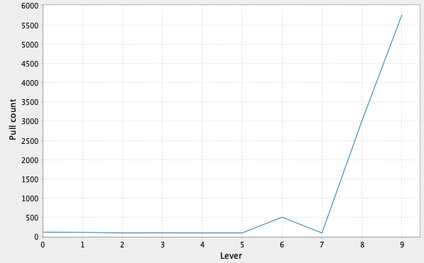
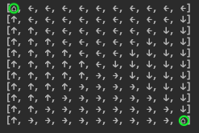
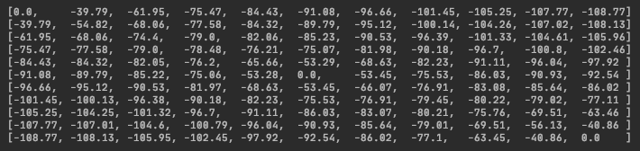

# Reinforcement learning

Referred material

- Book by Sutton & Barto - [Reinforcement Learning: An Introduction](http://incompleteideas.net/book/the-book-2nd.html)
- Lectures by David Silver - [Introduction to reinforcement learning](https://www.youtube.com/playlist?list=PLqYmG7hTraZDM-OYHWgPebj2MfCFzFObQ) 

## [Tic-Tac-Toe](/src/main/scala/tictactoe/)

Basic tic-tac-toe game. Uses basic probability matrix for each game state to make decisions. **WIP** - needs better prediction.

## [Multi Arm Bandit](/src/main/scala/bandit/Bandit.scala)
Bandit from chapter 2. Uses incremental implementation.

10 levers with probability of `[0.5, 0.10, 0.20, 0.25, 0.30, 0.50, 0.60, 0.65, 0.80, 0.90]` for each lever in that order. 



Last lever has the highest probability (`0.90`) therefore has more chance of getting pulled.

## [Perceptron](/src/main/scala/neuron/Perceptron.scala)

A simple example that returns the head/first integer from an input `Array[Int]` by learning from training data set only 
without explicitly defining the rule to "_return the head integer_".   

## [Student Markov Chain](/src/main/scala/lecture/Student.scala)

Implements the `Student MDP` from David Silver's lecture 2 at [this (24:56)](https://youtu.be/lfHX2hHRMVQ?list=PLqYmG7hTraZDM-OYHWgPebj2MfCFzFObQ&t=1496) timestamp.
There are tests in [StudentSpec](/src/test/scala/lecture/StudentSpec.scala) that prove that no other state can 
return the same optimal value as optimal state using bellman equation.  

```console
Value: -2.25      Sample: List(Class1, Class2, Class3, Pass, Sleep)
Value: -3.125     Sample: List(Class1, Facebook, Facebook, Class1, Class2, Sleep)
Value: -3.65625   Sample: List(Class1, Class2, Class3, Pub, Class2, Class3, Pass, Sleep)
Value: -2.21875   Sample: List(Facebook, Facebook, Facebook, Class1, Class2, Class3, Pub, Class2, Sleep)
```

## Grid World

### [Agent - Dynamic Programming](/src/main/scala/grid/AgentDP.scala)

Implements bellman equation to find the quickest path to targets within a grid. 

The following shows results of a 11x11 grid with 3 goal targets - ⌂ (circled green). The arrows indicate the optimal direction 
to take at each grid to reach the nearest target.  



Value function created after 100 value iteration.
 

