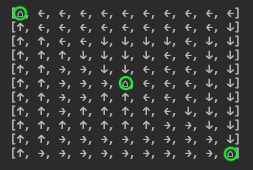

# Reinforcement learning

Material I'm referring to is

- Book - [Reinforcement Learning: An Introduction - Sutton & Barto](http://incompleteideas.net/book/the-book-2nd.html)
- Lectures by [Introduction to reinforcement learning - David Silver](https://www.youtube.com/playlist?list=PLqYmG7hTraZDM-OYHWgPebj2MfCFzFObQ) 

## [Tic-Tac-Toe](/src/main/scala/tictactoe/)

Basic tic-tac-toe game. Uses basic probability matrix for each game state to make decisions.

## [Multi Arm Bandit](/src/main/scala/bandit/Bandit.scala)
Bandit from chapter 2. Uses incremental implementation.

10 levers with probability of `[0.5, 0.10, 0.20, 0.25, 0.30, 0.50, 0.60, 0.65, 0.80, 0.90]` for each lever in that order. 

Last lever has the highest probability (`0.90`) therefore has more chance of getting pulled.

## [Grid world](/src/main/scala/grid/GridWorld.scala)

Implements bellman's equation to find the quickest path to targets within a grid. 

The following is a 11x11 grid with 3 targets - ⌂ (circled green). The arrows indicate the optimal direction 
to take at each grid to reach the nearest target.  

Value function created after 100 value iteration.
 

